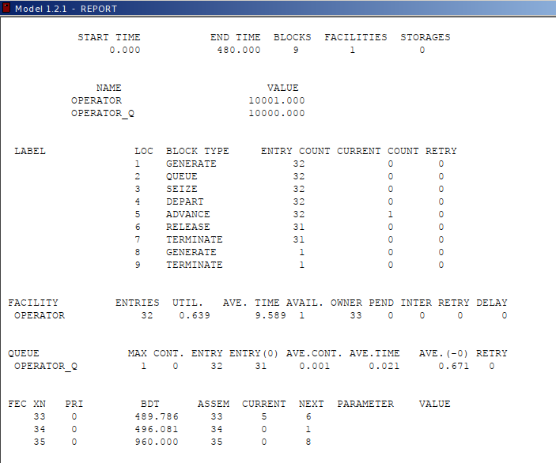
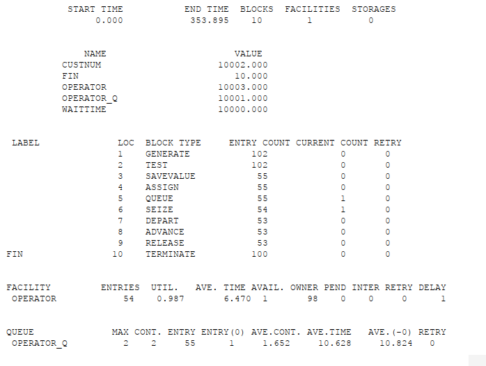
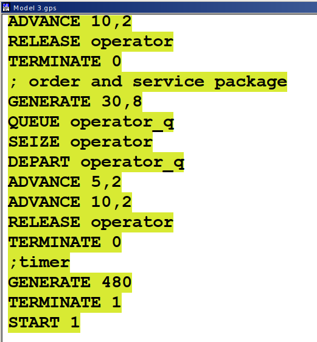
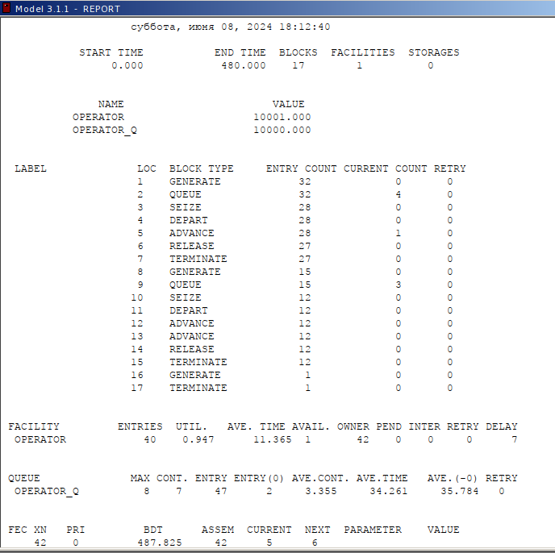

---
## Front matter
title: "Лабораторная работа 14"
subtitle: "Модели обработки заказов"
author: "Городянский Фёдор Николаевич"

## Generic options
lang: ru-RU
toc-title: "Содержание"

## Bibliography
bibliography: bib/cite.bib
csl: pandoc/csl/gost-r-7-0-5-2008-numeric.csl

## Pdf output format
toc: true # Table of contents
toc-depth: 2
lof: true # List of figures
lot: false # List of tables
fontsize: 13pt
linestretch: 1.5
papersize: a4
documentclass: scrreprt
## I18n polyglossia
polyglossia-lang:
  name: russian
  options:
    - spelling=modern
    - babelshorthands=true
polyglossia-otherlangs:
  name: english
## I18n babel
babel-lang: russian
babel-otherlangs: english
## Fonts
mainfont: PT Serif
romanfont: PT Serif
sansfont: PT Sans
monofont: PT Mono
mainfontoptions: Ligatures=TeX
romanfontoptions: Ligatures=TeX
sansfontoptions: Ligatures=TeX,Scale=MatchLowercase
monofontoptions: Scale=MatchLowercase,Scale=0.9
## Biblatex
biblatex: true
biblio-style: "gost-numeric"
biblatexoptions:
  - parentracker=true
  - backend=biber
  - hyperref=auto
  - language=auto
  - autolang=other*
  - citestyle=gost-numeric
## Pandoc-crossref LaTeX customization
figureTitle: "Рис."
tableTitle: "Таблица"
listingTitle: "Листинг"
lofTitle: "Список иллюстраций"
lotTitle: "Список таблиц"
lolTitle: "Листинги"
## Misc options
indent: true
header-includes:
  - \usepackage{indentfirst}
  - \usepackage{float} # keep figures where there are in the text
  - \floatplacement{figure}{H} # keep figures where there are in the text
---

# Цель работы

Реализовать модели обработки заказов и провести анализ результатов.

# Задание

Реализовать с помощью gpss:

- модель оформления заказов клиентов одним оператором;
- построение гистограммы распределения заявок в очереди;
- модель обслуживания двух типов заказов от клиентов в интернет-магазине;
- модель оформления заказов несколькими операторами.

# Выполнение лабораторной работы

## Модель оформления заказов клиентов одним оператором

Порядок блоков в модели соответствует порядку фаз обработки заказа в реальной системе:

1) клиент оставляет заявку на заказ в интернет-магазине;
2) если необходимо, заявка от клиента ожидает в очереди освобождения оператора для оформления заказа;
3) заявка от клиента принимается оператором для оформления заказа;
4) оператор оформляет заказ;
5) клиент получает подтверждение об оформлении заказа (покидает систему).

Модель будет состоять из двух частей: моделирование обработки заказов в интернет-магазине и задание времени моделирования. Для задания равномерного распределения поступления заказов используем блок `GENERATE`, для задания равномерного времени обслуживания (задержки в системе) -- `ADVANCE`. Для моделирования ожидания заявок клиентов в очереди используем блоки `QUEUE` и `DEPART`, в которых в качестве имени очереди укажем `operator_q` Для моделирования поступления заявок для оформления заказов к оператору используем блоки `SEIZE` и `RELEASE` с параметром `operator` — имени «устройства обслуживания».

Требуется, чтобы модельное время было 8 часов. Соответственно, параметр блока `GENERATE` -- 480 (8 часов по 60 минут, всего 480 минут). Работа программы начинается с оператора `START` с начальным значением счётчика завершений, равным 1; заканчивается -- оператором `TERMINATE` с параметром 1, что задаёт ординарность потока в модели.

Таким образом, имеем (рис. [-@fig:001]).

{#fig:001 width=70%}

После запуска симуляции получаем отчёт (рис. [-@fig:002]).

{#fig:002 width=70%}

Результаты работы модели:

- модельное время в начале моделирования: `START TIME`=0.0;
- абсолютное время или момент, когда счетчик завершений принял значение 0: `END TIME`=480.0;
- количество блоков, использованных в текущей модели, к моменту завершения моделирования: `BLOCKS`=9;
- количество одноканальных устройств, использованных в модели к моменту завершения моделирования: `FACILITIES`=1;
- количество многоканальных устройств, использованных в текущей модели к моменту завершения моделирования: `STORAGES`=0. Имена, используемые в программе модели: `operator`, `operator_q`. 

Далее идёт информация о блоках текущей модели, в частности, `ENTRY COUNT` -- количество транзактов, вошедших в блок с начала процедуры моделирования. 

Затем идёт информация об одноканальном устройстве `FACILITY` (оператор, оформляющий заказ), откуда видим, что к оператору попало 33 заказа от клиентов (значение поля `OWNER`=33), но одну заявку оператор не успел принять в обработку до окончания рабочего времени (значение поля `ENTRIES`=32). Полезность работы оператора составила 0, 639. При этом среднее время занятости оператора составило 9, 589 мин.

Далее информация об очереди:

- `QUEUE`=`operator_q` -- имя объекта типа «очередь»;
- `MAX`=1 -- в очереди находилось не более одной ожидающей заявки от клиента;
- `CONT`=0 -- на момент завершения моделирования очередь была пуста;
- `ENTRIES`=32 -- общее число заявок от клиентов, прошедших через очередь в течение периода моделирования;
- `ENTRIES(O)`=31 -- число заявок от клиентов, попавших к оператору без ожидания в очереди;
- `AVE.CONT`=0, 001 заявок от клиентов в среднем были в очереди;
- `AVE.TIME`=0.021 минут в среднем заявки от клиентов провели в очереди (с учётом всех входов в очередь);
- `AVE.(–0)`=0, 671 минут в среднем заявки от клиентов провели в очереди (без учета «нулевых» входов в очередь).

В конце отчёта идёт информация о будущих событиях:

- XN=33 -- порядковый номер заявки от клиента, ожидающей поступления для оформления заказа у оператора;
- PRI=0 -- все клиенты (из заявки) равноправны;
- BDT=489, 786 -- время назначенного события, связанного с данным транзактом;
- ASSEM=33 -- номер семейства транзактов;
- CURRENT=5 -- номер блока, в котором находится транзакт;
- NEXT=6 -- номер блока, в который должен войти транзакт.

**Упражнение**

Изменим интервалы поступления заказов и время оформления клиентов (рис. [-@fig:003]).

{#fig:003 width=70%}

После запуска симуляции получаем отчёт (рис. [-@fig:004]).

{#fig:004 width=70%}

Результаты работы модели:

- модельное время в начале моделирования: `START TIME`=0.0;
- абсолютное время или момент, когда счетчик завершений принял значение 0: `END TIME`=480.0;
- количество блоков, использованных в текущей модели, к моменту завершения моделирования: `BLOCKS`=9;
- количество одноканальных устройств, использованных в модели к моменту завершения моделирования: `FACILITIES`=1;
- количество многоканальных устройств, использованных в текущей модели к моменту завершения моделирования: `STORAGES`=0. 

Имена, используемые в программе модели: `operator`, `operator_q`. 

- количество транзактов, вошедших в блок с начала процедуры моделирования `ENTRY COUNT` = 152;

Затем идёт информация об одноканальном устройстве `FACILITY` (оператор, оформляющий заказ), откуда видим, что к оператору попало 71 заказ от клиентов (значение поля `OWNER`=71), но оператор успел принять в обработку до окончания рабочего времени только 70 (значение поля `ENTRIES`=70). Полезность работы оператора составила 0,991. При этом среднее время занятости оператора составило 6,796 мин.

Далее информация об очереди:

- `QUEUE`=`operator_q` -- имя объекта типа «очередь»;
- `MAX`=82 -- в очереди находилось 82 ожидающих заявок от клиента;
- `CONT`=82 -- на момент завершения моделирования в очереди было 82 заявки;
- `ENTRIES`=82 -- общее число заявок от клиентов, прошедших через очередь в течение периода моделирования;
- `ENTRIES(O)`=1 -- число заявок от клиентов, попавших к оператору без ожидания в очереди;
- `AVE.CONT`=39,096 заявок от клиентов в среднем были в очереди;
- `AVE.TIME`=123.461 минут в среднем заявки от клиентов провели в очереди (с учётом всех входов в очередь);
- `AVE.(-0)`=123,279 минут в среднем заявки от клиентов провели в очереди (без учета «нулевых» входов в очередь).

В конце отчёта идёт информация о будущих событиях.

## Построение гистограммы распределения заявок в очереди

Требуется построить гистограмму распределения заявок, ожидающих обработки в очереди в примере из предыдущего упражнения. Для построения гистограммы необходимо сформировать таблицу значений заявок в очереди, записываемых в неё с определённой частотой.

Команда описания такой таблицы `QTABLE` имеет следующий формат: `Name QTABLE A,B,C,D`
Здесь `Name` -- метка, определяющая имя таблицы. Далее должны быть заданы операнды: `А` задается элемент данных, чьё частотное распределение будет заноситься в таблицу (может быть именем, выражением в скобках или системным числовым атрибутом (СЧА)); `B` задается верхний предел первого частотного интервала; `С` задает ширину частотного интервала — разницу между верхней и нижней границей каждого частотного класса; `D` задаёт число частотных интервалов. 

Код программы будет следующим(рис. [-@fig:005]).

{#fig:005 width=70%}

Здесь `Waittime` — метка оператора таблицы очередей `QTABLE`, в данном случае название таблицы очереди заявок на заказы. Строка с оператором `TEST` по смыслу аналогично действиям оператора `IF` и означает, что если в очереди 0 или 1 заявка, то осуществляется переход к следующему оператору, в данном случае к оператору `SAVEVALUE`, в противном случае (в очереди более одной заявки) происходит переход к оператору с меткой `Fin`, то есть заявка удаляется из системы, не попадая на обслуживание. Строка с оператором `SAVEVALUE` с помощью операнда `Custnum` подсчитывает число заявок на заказ, попавших в очередь. Далее оператору `ASSIGN` присваивается значение СЧА оператора `Custnum`.

Получим отчет симуляции и проанализируем его (рис. [-@fig:006], [-@fig:007]).

{#fig:006 width=70%}

{#fig:007 width=70%}

Результаты работы модели:

- модельное время в начале моделирования: `START TIME`=0.0;
- абсолютное время или момент, когда счетчик завершений принял значение 0: `END TIME`=353.895;
- количество блоков, использованных в текущей модели, к моменту завершения моделирования: `BLOCKS`=10;
- количество одноканальных устройств, использованных в модели к моменту завершения моделирования: `FACILITIES`=1;
- количество многоканальных устройств, использованных в текущей модели к моменту завершения моделирования: `STORAGES`=0. 

Имена, используемые в программе модели: `operator`, `operator_q`. 

- количество транзактов, вошедших в блок с начала процедуры моделирования `ENTRY COUNT` = 102;

Затем идёт информация об одноканальном устройстве `FACILITY` (оператор, оформляющий заказ), откуда видим, что к оператору попало 98 заказов от клиентов (значение поля `OWNER`=98), но оператор успел принять в обработку до окончания рабочего времени только 54 (значение поля `ENTRIES`=54). Полезность работы оператора составила 0,987. При этом среднее время занятости оператора составило 6,470 мин.

Далее информация об очереди:

- `QUEUE`=`operator_q` -- имя объекта типа «очередь»;
- `MAX`=2 -- в очереди находилось не более двух ожидающих заявок от клиента;
- `CONT`=2 -- на момент завершения моделирования в очереди было два клиента;
- `ENTRIES`=55 -- общее число заявок от клиентов, прошедших через очередь в течение периода моделирования;
- `ENTRIES(O)`=1 -- число заявок от клиентов, попавших к оператору без ожидания в очереди;
- `AVE.CONT`=1,652 заявок от клиентов в среднем были в очереди;
- `AVE.TIME`=10.628 минут в среднем заявки от клиентов провели в очереди (с учётом всех входов в очередь);
- `AVE.(-0)`=10,824 минут в среднем заявки от клиентов провели в очереди (без учета «нулевых» входов в очередь).

Также появилась таблица с информацией для гистограммы: частотность разделена на 15 частотных интервалов с шагом 2 и началом в 0, как мы и задали. Наибольшее количество заявок(17) обрабатывалось в диапазоне 10-12 минут. 

В конце отчёта идёт информация о будущих событиях.

Проанализируем гистограмму (рис. [-@fig:008]).

{#fig:008 width=70%}

Частотность разделена на 15 частотных интервалов с шагом 2 и началом в 0, как мы и задали. Наибольшее количество заявок (17) обрабатывалось 10-12 минут, 14 заявок -- 12-14 минут, 12 заявок -- 8-10 минут, в остальных диапазонах 0-4 заявок. 

## Модель обслуживания двух типов заказов от клиентов в интернет-магазине

Необходимо реализовать отличие в оформлении обычных заказов и заказов с дополнительным пакетом услуг. Такую систему можно промоделировать с помощью двух сегментов. Один из них моделирует оформление обычных заказов, а второй -- заказов с дополнительным пакетом услуг. В каждом из сегментов пара `QUEUE–DEPART` должна описывать одну и ту же очередь, а пара блоков `SEIZE–RELEASE` должна описывать в каждом из двух сегментов одно и то же устройство и моделировать работу оператора.
Код и отчет результатов моделирования следующие (рис. [-@fig:009], [-@fig:010]).

{#fig:009 width=70%}

{#fig:010 width=70%}

Результаты работы модели:

- модельное время в начале моделирования: `START TIME`=0.0;
- абсолютное время или момент, когда счетчик завершений принял значение 0: `END TIME`=480.0;
- количество блоков, использованных в текущей модели, к моменту завершения моделирования: `BLOCKS`=17;
- количество одноканальных устройств, использованных в модели к моменту завершения моделирования: `FACILITIES`=1;
- количество многоканальных устройств, использованных в текущей модели к моменту завершения моделирования: `STORAGES`=0. 

Имена, используемые в программе модели: `operator`, `operator_q`. 

- количество транзактов, вошедших в блок первого типа заказов с начала процедуры моделирования `ENTRY COUNT` = 32, а второго типа(с дополнительными услугами) `ENTRY COUNT` = 15; обработано 12+27 = 39;

Затем идёт информация об одноканальном устройстве `FACILITY` (оператор, оформляющий заказ), откуда видим, что к оператору попало 42 заказ от клиентов (значение поля `OWNER`=42), но оператор успел принять в обработку до окончания рабочего времени только 40 (значение поля ENTRIES=40). Полезность работы оператора составила 0,947. При этом среднее время занятости оператора составило 11,365 мин.

Далее информация об очереди:

- `QUEUE`=`operator_q` -- имя объекта типа «очередь»;
- `MAX`=8 -- в очереди находилось не более двух ожидающих заявок от клиента;
- `CONT`=7 -- на момент завершения моделирования в очереди было 7 клиентов;
- `ENTRIES`=47 -- общее число заявок от клиентов, прошедших через очередь в течение периода моделирования;
- ``ENTRIES(O)`=2 -- число заявок от клиентов, попавших к оператору без ожидания в очереди;
- `AVE.CONT`=3,355 заявок от клиентов в среднем были в очереди;
- `AVE.TIME`=34,261 минут в среднем заявки от клиентов провели в очереди (с учётом всех входов в очередь);
- `AVE.(-0)`=35,784 минут в среднем заявки от клиентов провели в очереди (без учета «нулевых» входов в очередь).

В конце отчёта идёт информация о будущих событиях.

**Упражнение**

Скорректируем модель так, чтобы учитывалось условие, что число заказов с дополнительным пакетом услуг составляет 30% от общего числа заказов.

Будем использовать один блок `order`, а разделим типы заявок с помощью переходов оператором `TRANSFER`. Каждый заказ обрабатывается $10 \pm 2$ минуты, после этого зададим оператор `TRANSFER`, в котором укажем, что с вероятностью 0.7 происходит обработка заявки (переход к блоку `noextra` `RELEASE` operator), а с вероятностью 0.3 дополнительно заказ обрабатывается еще $5 \pm 2$ минуты (переход к блоку `extra` `ADVANCE` 5,2) и только после этого является обработанным ( рис. [-@fig:011]).

{#fig:011 width=70%}

Проанализируем результаты моделирования (рис. [-@fig:012]).

{#fig:012 width=70%}

Результаты работы модели:

- модельное время в начале моделирования: `START TIME`=0.0;
- абсолютное время или момент, когда счетчик завершений принял значение 0: `END TIME`=480.0;
- количество блоков, использованных в текущей модели, к моменту завершения моделирования: `BLOCKS`=11;
- количество одноканальных устройств, использованных в модели к моменту завершения моделирования: `FACILITIES`=1;
- количество многоканальных устройств, использованных в текущей модели к моменту завершения моделирования: `STORAGES`=0. 

Имена, используемые в программе модели: `operator`, `operator_q`. 

- количество транзактов, вошедших в блок заказов с начала процедуры моделирования `ENTRY COUNT` = 33, при этом из них второго типа (с дополнительными услугами) `ENTRY COUNT` = 8; обработано 32 заказа;

Затем идёт информация об одноканальном устройстве `FACILITY` (оператор, оформляющий заказ), откуда видим, что к оператору попало 34 заказа от клиентов (значение поля `OWNER`=34), но оператор успел принять в обработку до окончания рабочего времени только 33 (значение поля `ENTRIES`=33). Полезность работы оператора составила 0,766. При этом среднее время занятости оператора составило 11,146 мин.

Далее информация об очереди:

- `QUEUE`=`operator_q` -- имя объекта типа «очередь»;
- `MAX`=1 -- в очереди находилось не более двух ожидающих заявок от клиента;
- `CONT`=0 -- на момент завершения моделирования в очереди было ноль клиентов;
- `ENTRIES`=33 -- общее число заявок от клиентов, прошедших через очередь в течение периода моделирования;
- `ENTRIES(O)`=25 -- число заявок от клиентов, попавших к оператору без ожидания в очереди;
- `AVE.CON`T=0,054 заявок от клиентов в среднем были в очереди;
- `AVE.TIME`=0.781 минут в среднем заявки от клиентов провели в очереди (с учётом всех входов в очередь);
- `AVE.(-0)`=3,220 минут в среднем заявки от клиентов провели в очереди (без учета «нулевых» входов в очередь).

В конце отчёта идёт информация о будущих событиях.

## Модель оформления заказов несколькими операторами

В интернет-магазине заказы принимают 4 оператора. Интервалы поступления заказов распределены равномерно с интервалом $5 \pm 2$ мин. Время оформления заказа каждым оператором также распределено равномерно на интервале $10 \pm 2$ мин. обработка поступивших заказов происходит в порядке очереди (FIFO). Требуется определить характеристики очереди заявок на оформление заказов при условии, что заявка может обрабатываться одним из 4-х операторов в течение восьмичасового рабочего дня

С помощью строки `operator STORAGE 4` указываем, что у нас 4 оператора, затем к обычной процедуре генерации и обработки заявки добавляется, что заявку обрабатывает один оператор `operator,1`, сегмент моделирования времени остается без изменений (рис. [-@fig:013]).

{#fig:013 width=70%}

Далее получим и проанализируем отчет (рис. [-@fig:014]).

{#fig:014 width=70%}

Результаты работы модели:

- модельное время в начале моделирования: `START TIME`=0.0;
- абсолютное время или момент, когда счетчик завершений принял значение 0: `END TIME`=480.0;
- количество блоков, использованных в текущей модели, к моменту завершения моделирования: `BLOCKS`=9;
- количество одноканальных устройств, использованных в модели к моменту завершения моделирования: `FACILITIES`=1;
- количество многоканальных устройств, использованных в текущей модели к моменту завершения моделирования: `STORAGES`=0. 

Имена, используемые в программе модели: `operator`, `operator_q`. 

- количество транзактов, вошедших в блок заказов с начала процедуры моделирования `ENTRY COUNT` = 93; обработан 91 заказ;

Далее информация об очереди:

- `QUEUE`=`operator_q` -- имя объекта типа «очередь»;
- `MAX`=1 -- в очереди находилось не более двух ожидающих заявок от клиента;
- `CONT`=0 -- на момент завершения моделирования в очереди было ноль клиентов;
- `ENTRIES`=93 -- общее число заявок от клиентов, прошедших через очередь в течение периода моделирования;
- `ENTRIES(O)`=93 -- число заявок от клиентов, попавших к оператору без ожидания в очереди;
- `AVE.CONT`=0,000 -- заявок от клиентов в среднем были в очереди;
- `AVE.TIME`=0.000 минут в среднем заявки от клиентов провели в очереди (с учётом всех входов в очередь);
- `AVE.(-0)`=0,000 минут в среднем заявки от клиентов провели в очереди (без учета «нулевых» входов в очередь).

Затем идёт информация о многоканальном устройстве `STORAGE` (оператор, оформляющий заказ), откуда видим, что к операторам попало 93 заказа от клиентов, но не указано, сколько операторы успели принять в обработку. Полезность работы операторов составила 0,482. При этом среднее время занятости оператора составило 1,926 мин. Также появились значения, характерные для `STORAGE`: вместительность 4, максимальное число одновременно работающих операторов -- 4, минимальное -- 0.

В конце отчёта идёт информация о будущих событиях.

**Упражнение**

Изменим модель: требуется учесть в ней возможные отказы клиентов от заказа -- когда при подаче заявки на заказ клиент видит в очереди более двух других заявок, он отказывается от подачи заявки, то есть отказывается от обслуживания (используем блок `TEST` и стандартный числовой атрибут Qj текущей длины очереди j).

Добавим строчку `TEST LE Q$operator_q,2`, которая проверяет больше ли в очереди клиентов, чем два, если нет -- клиент поступает на обработку, иначе уходит. Также в ранее проанализированном отчете видно, что клиентов в очереди не было больше 2, поэтому увеличим время обработки заказов до $30 \pm 2$ мин., чтобы проверить результаты изменений модели (рис. [-@fig:015]).

{#fig:015 width=70%}

Проанализируем полученный отчет (рис. [~@fig:016]).

{#fig:016 width=70%}

Результаты работы модели:

- модельное время в начале моделирования: `START TIME`=0.0;
- абсолютное время или момент, когда счетчик завершений принял значение 0: `END TIME`=480.0;
- количество блоков, использованных в текущей модели, к моменту завершения моделирования: `BLOCKS`=9;
- количество одноканальных устройств, использованных в модели к моменту завершения моделирования: `FACILITIES`=1;
- количество многоканальных устройств, использованных в текущей модели к моменту завершения моделирования: `STORAGES`=0. 

Имена, используемые в программе модели: `operator`, `operator_q`. 

- количество транзактов, вошедших в блок заказов с начала процедуры моделирования `ENTRY COUNT` = 94; обработано 60 заказа; 27 человек отказались оставлять заявки, поскольку очередь была более 2ух заявок.

Далее информация об очереди:

- `QUEUE`=`operator_q` -- имя объекта типа «очередь»;
- `MAX`=3 -- в очереди находилось не более трех ожидающих заявок от клиента(как и было указано);
- `CONT`=3 -- на момент завершения моделирования в очереди было ноль клиентов;
- `ENTRIES`=67 -- общее число заявок от клиентов, прошедших через очередь в течение периода моделирования;
- `ENTRIES(O)`=4 -- число заявок от клиентов, попавших к оператору без ожидания в очереди;
- `AVE.CONT`=2,701 -- заявок от клиентов в среднем были в очереди;
- `AVE.TIME`=19,347 минут в среднем заявки от клиентов провели в очереди (с учётом всех входов в очередь);
- `AVE.(-0)`=20,576 минут в среднем заявки от клиентов провели в очереди (без учета «нулевых» входов в очередь).

Затем идёт информация о многоканальном устройстве `STORAGE` (оператор, оформляющий заказ), откуда видим, что к операторам попало 64 заказов от клиентов. Полезность работы операторов составила 0,971. При этом среднее время занятости оператора составило 3,885 мин. Также появились значения, характерные для `STORAGE`: вместительность 4, максимальное число одновременно работающих операторов -- 4, минимальное -- 0.

В конце отчёта идёт информация о будущих событиях.

# Выводы

В результате была реализована с помощью gpss:

- модель оформления заказов клиентов одним оператором;
- построение гистограммы распределения заявок в очереди;
- модель обслуживания двух типов заказов от клиентов в интернет-магазине;
- модель оформления заказов несколькими операторами.

